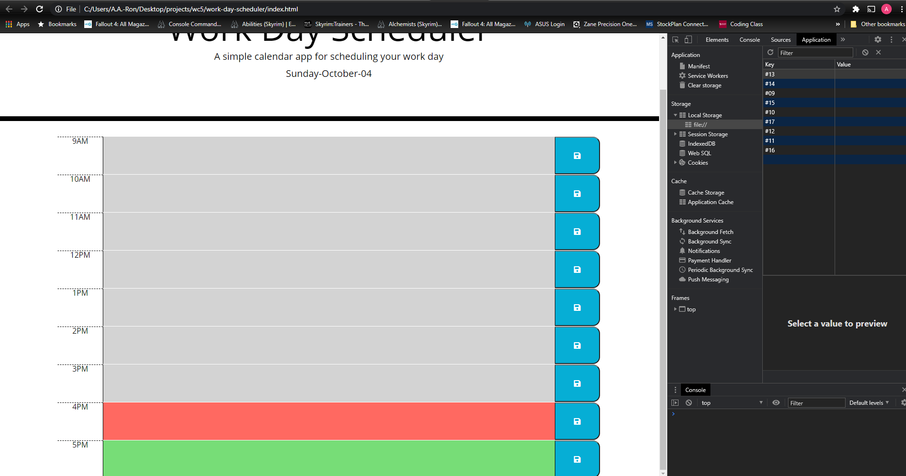

# Work Day Scheduler

https://geigea84.github.io/work-day-scheduler/

This is a day planner, complete with time-blocks that you can edit, save, and refresh, as well as color coordination depending on time of day.

Technologies Used:
* HTML
* CSS
* JavaScript
* Moment.JS
* jQuery
* Bootstrap

GIVEN I am using a daily planner to create a schedule
WHEN I open the planner
THEN the current day is displayed at the top of the calendar
<!--done-->

WHEN I scroll down
THEN I am presented with time blocks for standard business hours
<!--done-->

WHEN I view the time blocks for that day
THEN each time block is color-coded to indicate whether it is in the past, present, or future
<!--done-->

WHEN I click into a time block
THEN I can enter an event
<!--done-->

WHEN I click the save button for that time block
THEN the text for that event is saved in local storage
<!--done-->

WHEN I refresh the page
THEN the saved events persist
<!--done-->
